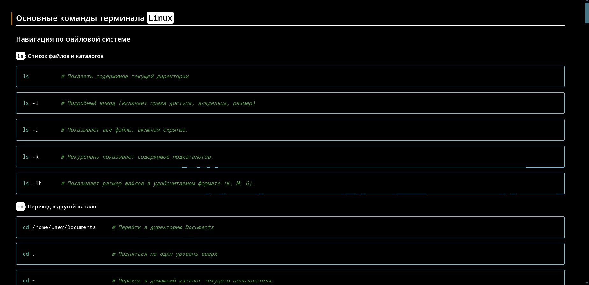

# 📚 Instruction Manual

Набор инструкций для быстрой установки, настройки и использования популярных инструментов разработчика.

## 🚀 Быстрый старт

| 📄  | Документ                                                                                                                            |
| --- | ----------------------------------------------------------------------------------------------------------------------------------- |
| 🐳  | [Основные команды Docker](./Basic_Docker_Commands.md)                                                                               |
| 🖥️ | [Основные команды Linux терминала](./Basic_Linux_Terminal_Commands.md)                                                              |
| 🛠️ | [Основные команды Git](./Basic_git_commands.md)                                                                                     |
| 🛠️ | [Базовые команды Git (дополнительно)](./Basic_git_cmd.md)                                                                           |
| 🖋️ | [Установка и обновление Visual Studio Code](./Installation_and_update_Visual_Studio_Code.md)                                        |
| 🖋️ | [Установка и настройка шрифтов в консоли](./Installing%20the%20font%20and%20the%20default%20font%20setting%20in%20the%20console.md) |
| 🐍  | [Создание виртуального окружения через Conda](./Installing_a_virtual_environment_using_conda.md)                                    |
| 🐍  | [Инструкция по установке Anaconda](./Instruction_install_anaconda.md)                                                               |
| 🐳  | [Установка и удаление Docker](./Instructions_for_installing_and_removing_Docker.md)                                                 |
| 🛠️ | [Установка Git](./Instructions_for_installing_git.md)

## 📖 О проекте

`Instruction Manual` — это коллекция кратких, удобных руководств для разработчиков, DevOps-инженеров и системных администраторов.
Каждый документ описывает практическое использование инструментов через примеры, команды и советы.

Основные цели:

- 📚 Быстрое обучение новичков

- 🛠️ Ускорение процессов установки и настройки

- 🧠 Минимизация ошибок за счёт чётких инструкций

## 🛠️ Как использовать

```bash
# Клонируйте репозиторий
git clone https://github.com/Sarmat01785/Instruction-manual.git

# Откройте нужный .md файл и следуйте инструкциям
```
Или просто переходите по ссылкам выше!

## 📷 Скриншоты



## 📄 Лицензия

Этот проект лицензирован под лицензией `MIT`.
